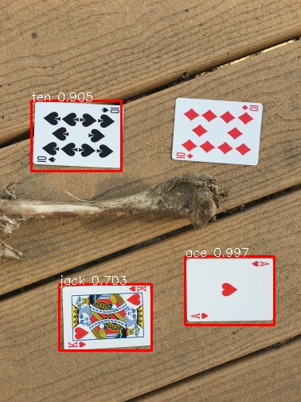
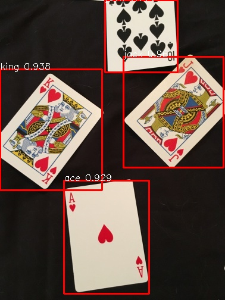

# Training Faster-RCNN on multiclass custom dataset
## 1. Introduction

Train object detector on multi-class custom dataset using Faster R-CCN in PyTorch. 

This framework has the follow features:
 - It is based on PyTorch framework
 - It is designed to train on custom dataset
 - It can train on multi-class dataset
 - It automatically creates lables.txt file
 
 ## 2. Installations
 ### 2.1 Prerequisites
  - Python 3
  - Numpy 
  - PyTorch 1.8.1
  - torchvision
  - Pandas
  - Opencv (cv2)

### 2.2 Code-Preparing
```bash
git clone https://github.com/harshatejas/pytorch_custom_object_detection.git
```

## 3. Dataset
This dataset contains images of playing cards.

The cards_dataset containds train folder, valication folder, train.csv and validation.csv
```bash
cards_datset/
 train/
   [xxx].jpg
   ...
 validation/
   [xxx].jpg
   ...
 train.csv
 validation.csv
```

## 4. Train
Modify Hyperparameters in train.py
```bash
train.py
```
## 5. Test
predict.py is designed to run predictions on the images in validation folder

Change the filename and saved_model in predict.py
```bash
predict.py
```
## 6. Predicted Images
Here are some sample output images predicted by saved_model/model






